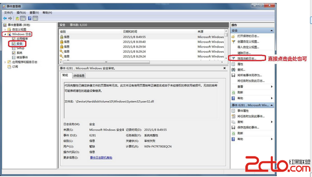
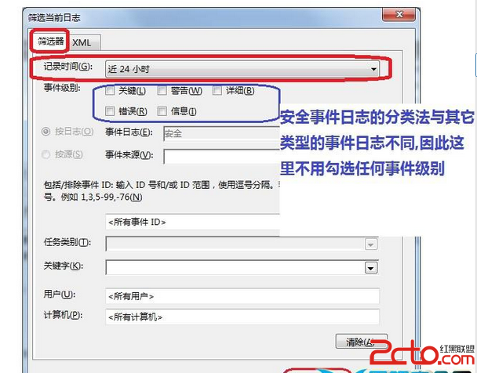
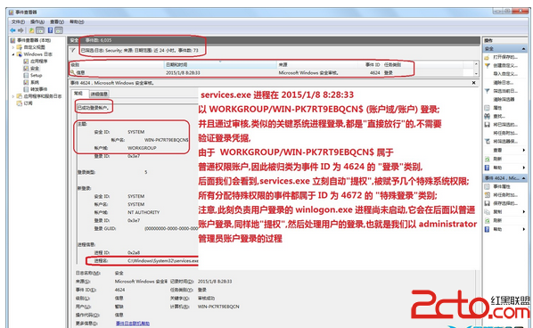

#事件日志检查
-

1. 首先按照上述步骤打开事件查看器,在左侧窗口中展开 "Windows 日志"节点,选取"安全"项目,此时在中间的窗口会列出自系统安装以来,记录的所有安全事件,假设我们要查看最近 24 小时以内的帐户登录与验证,审核,权力指派等事件,可以在"安全"项目上右击鼠标,在弹出的上下文菜单中选择"筛选当前日志(L)"

	

1. 在打开的对话框中,切换到"筛选器"标签,在"记录时间(G)"右侧的下拉列表中,选择"近 24 小时",然后点击下方的确定按钮	

2. 显示出筛选的结果,下面这张图显示了在 24 小时内纪录的 73 项安全事件(Microsoft Windows 安全审核是准确的称呼),你可以按照日期与时间列排序事件,或者按照事件ID,任务类别来排序时间
	

